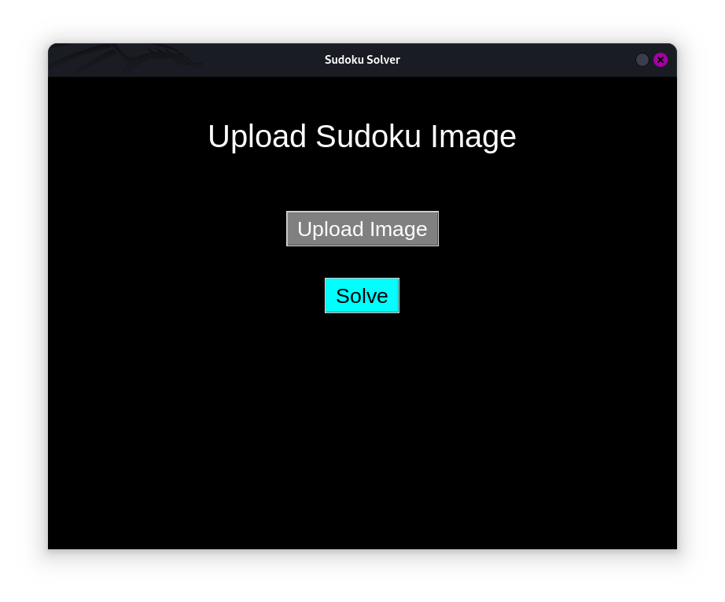
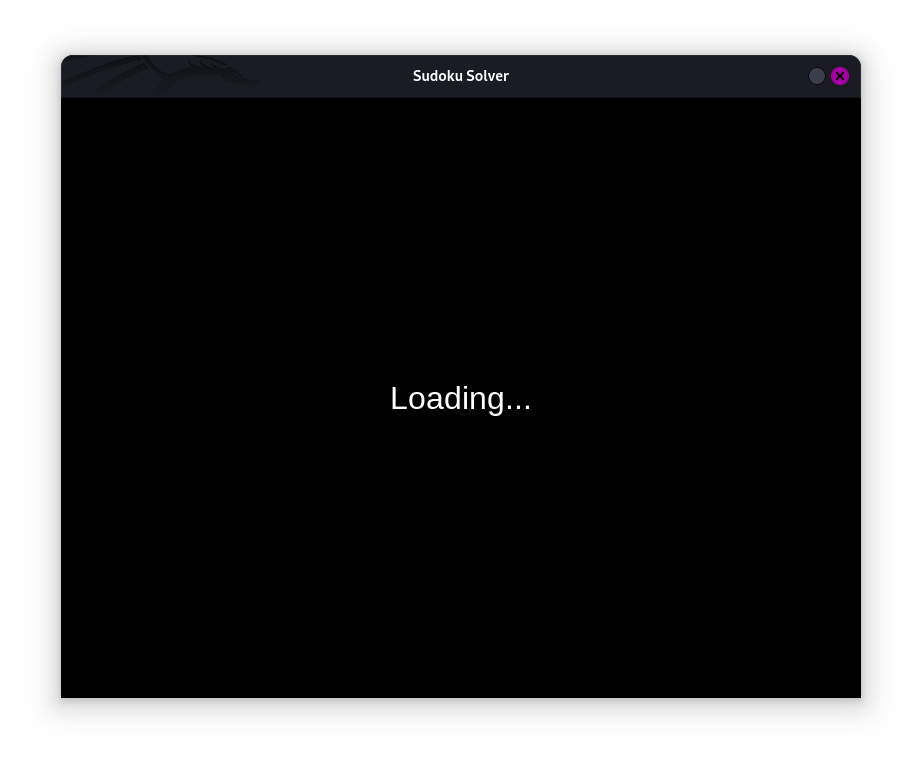
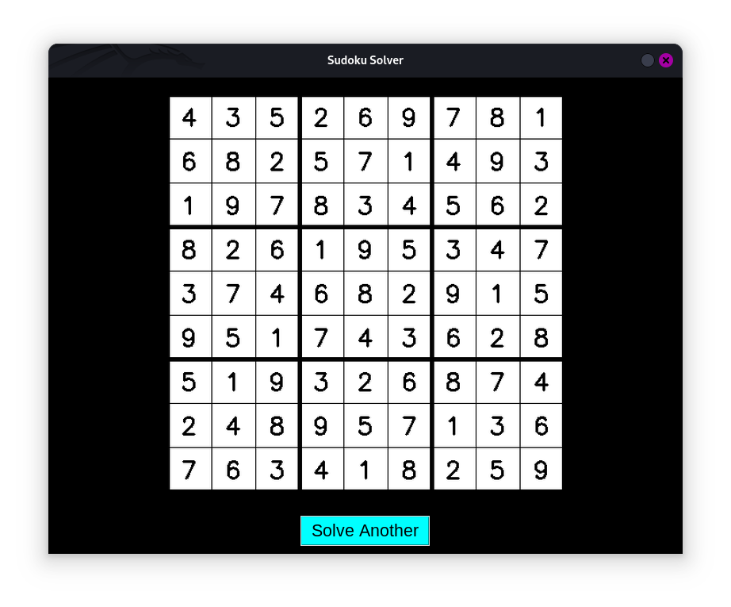
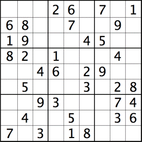

# PRODIGY_SD_04
Software Development Internship of InfoTech Prodigy

---

## Sudoku Solver with Image Input  
This project is a Python-based **Sudoku Solver** that allows users to upload an image of a Sudoku puzzle, processes the image to extract the grid, solves the puzzle using a backtracking algorithm, and displays the solved puzzle as an image.

### **Features**  
1. **Upload Sudoku Puzzle Image**  
   - Users can upload an image of a Sudoku puzzle (e.g., `test.png`).  
   - Handles noisy or non-square images using preprocessing.  

2. **Image Processing and Segmentation**  
   - Extracts the Sudoku grid and identifies individual cells using image-processing techniques.  

3. **Sudoku Solver**  
   - Uses a backtracking algorithm to solve the extracted 9x9 puzzle.  

4. **Output Display**  
   - Displays the solved Sudoku puzzle as an image.  

---

### **How It Works**  
#### **Workflow Overview**  
1. **Upload Phase**  
   - Users upload an image of the Sudoku puzzle.  
   - Interface example:  
       

2. **Loading Phase**  
   - Processes the uploaded image to extract and recognize the grid.  
   - Solves the puzzle in the background while displaying a loading animation.  
   - Interface example:  
       

3. **Output Phase**  
   - Displays the solved Sudoku puzzle.  
   - Users can solve another puzzle by clicking the "Solve More" button.  
   - Interface example:  
       

---

## **File Structure**  
```plaintext  
├── main.py          # Main controller  
├── upload.py        # Upload module  
├── loading.py       # Loading and solving logic  
├── print.py         # Output display  
├── preprocess.py    # Image preprocessing and grid extraction  
├── segment.py       # Grid segmentation  
├── recognize.py     # Cell recognition using OCR  
├── solver.py        # Backtracking Sudoku solver  
├── image/           # Directory for input and output images  
│   ├── input.png    # Uploaded Sudoku puzzle  
│   ├── processed.png # Processed grid  
│   ├── cells/       # Segmented cells from the grid  
│   └── output.png   # Solved Sudoku puzzle  
```  

---

## **Installation**  
1. Clone this repository:  
   ```bash  
   git clone https://github.com/shamiroxs/your-repo-name.git  
   ```  

2. Install the dependencies:  
   ```bash  
   pip install -r requirements.txt  
   ```  

3. Run the application:  
   ```bash  
   python main.py  
   ```  

---

## **Demo**  
### Input:  
Uploaded Image  
  

### Output:  
Solved Sudoku  
  

---

## **Technologies Used**  
- **Python**: Core programming language.  
- **OpenCV**: For image preprocessing and grid segmentation.  
- **Tkinter**: GUI interface.  
- **Pillow**: Image manipulation and rendering.  
- **Tesseract OCR**: Recognizing digits from segmented cells.  

---

## **Future Improvements**  
- Enhance OCR accuracy for noisy input images.  
- Implement crop.py to get exact segmentation of cells.  
- Find the error in given input, and prompt to the user.

---

## **Acknowledgments**  
This project was completed as part of an internship assignment at **InfoTech Prodigy**.  

